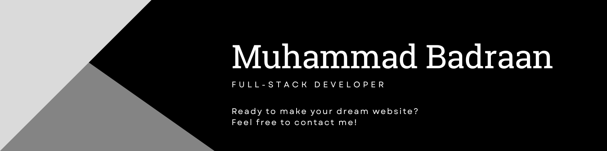

# Hi, I'm Muhammad Badraan 👋

## My Story

I’ve been into gaming since I was a kid — titles like **Minecraft**, **Fortnite**, and more. But playing them wasn’t enough for me. I needed to know **how** they were made. That curiosity got me started early: at around age 10, without a clear roadmap, I dove into anything I could find. I got my hands dirty with **Minecraft modding in Java**, **Python scripting**, and even **C# game development**.

Most people stop at that stage — it's chaotic and overwhelming. But for me, it was fun. That curiosity kept me going.

At 15, I joined **WE School**, where I began to specialize in **Web Development and Programming**. That’s when things got serious. I quickly found that I was good at it — and I enjoyed it even more. Today, web development is my main focus and what I do best.

---

## About Me

I'm a **Full-Stack Developer** with a strong focus on the **MERN stack** and solid experience in **Next.js**. I also build cross-platform apps using **React Native**, which led me to be the **Mobile App Developer**, **Backend Developer**, and **Team Leader** in **Athar** project.

---

## Skills

- **Languages:**

  
  
  
  
  

  
- **Frontend:**

  
  
  
  
  

- **Backend:**

  
  

  
- **Databases:**

  
  

- **Other:**

  
  

---

## Projects

- 🔗 [**Athar:**](https://athar-server-production.up.railway.app) A full-stack application where I handled the backend, mobile app, and team coordination.  

---

## Get in Touch

- [Linkedin](https://www.linkedin.com/in/badraan)  
- [Email](mailto:badraanmo@gmail.com)  
- Available on WhatsApp (DM for contact)

---

Thanks for visiting my profile! Feel free to explore my repositories and connect.
